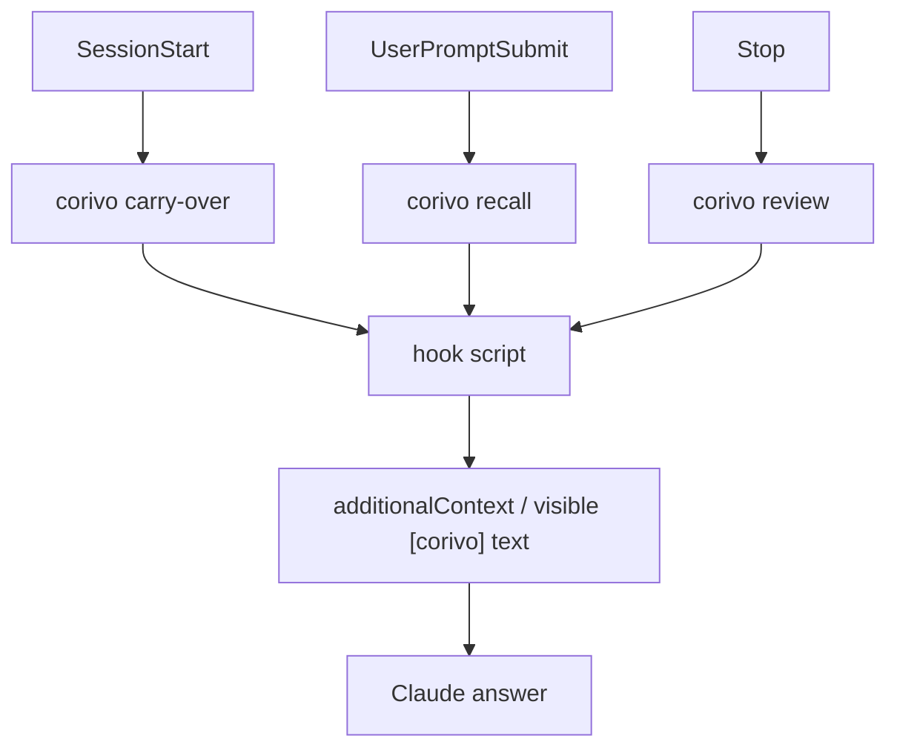

# Corivo Recall Runtime

## 背景

这次改动把 Corivo 在 Claude Code 内的“记忆补充”从单一的 `suggest` 机制，重构成三条明确的运行时路径：

- `carry-over`
- `recall`
- `review`

目标不是做一个静默、克制、低存在感的记忆层，而是让 Corivo 在真正命中时，能明显地参与当前对话，并且让用户感知到 **“这是 Corivo 带来的信息”**。

## 设计原则

### 1. 触发逻辑下沉到 CLI/runtime

hook 脚本只负责：

- 读取 Claude Code lifecycle event 的 JSON
- 调用对应的 `corivo` 内部命令
- 将结果通过 `additionalContext` 回传给 Claude

真正的触发、检索、排序、模式选择逻辑都在 `packages/cli/src/runtime/` 中实现。

### 2. UserPromptSubmit 是主召回点

旧设计主要依赖 `Stop -> suggest`。  
新设计把主要的历史召回前置到 `UserPromptSubmit`：

- 用户刚输入时，Corivo 尝试召回历史记忆
- Claude 在本轮回答前就能拿到这份记忆

`Stop` 不再承担主要 recall，而是转为 `review`。

### 3. 允许低相关命中，但要承认不确定

不是只有“高相关”才允许 surfacing。

模式分为：

- `carry_over`
- `recall`
- `challenge`
- `uncertain`
- `review`

其中 `uncertain` 专门用于“有 plausible 关联，但相关性不够强”的场景。

### 4. 用户必须感知到 Corivo

当 recall/review 命中时，返回内容需要以 `[corivo]` 开头。  
进一步地，hook 专用输出格式会附带一条归因指令：

> 如果你采纳了这条来自 Corivo 的记忆，请在回答中明确说“根据 Corivo 的记忆”或“从 Corivo 中查到”。

这样做的目的是提升用户对 Corivo 的感知，而不是让它仅作为隐藏上下文存在。

## 运行时结构



## CLI 命令

新增命令：

- `corivo carry-over`
- `corivo recall`
- `corivo review`

兼容命令：

- `corivo suggest`

其中 `suggest` 作为兼容壳：

- `session-start` -> `carry-over`
- `post-request` -> `review`

## 输出格式

### text

用于普通 shell / 本地调试：

```text
[corivo] 你们之前已经决定继续使用 Redis。
原因：当前提问和已有决策直接相关。
建议：先确认是否要推翻旧决策。
```

### json

用于测试和结构化验证：

```json
{
  "mode": "challenge",
  "confidence": "high",
  "whyNow": "当前提问看起来正在推动一个已经存在的决策发生变化。",
  "claim": "我们之前决定继续使用 Redis 作为缓存层。",
  "evidence": ["决策 · project · cache"],
  "memoryIds": ["blk_xxx"],
  "suggestedAction": "先确认是否要推翻旧决策。"
}
```

### hook-text

用于 Claude Code 的 recall/review hook：

```text
[corivo] 你们之前已经决定继续使用 Redis。
原因：当前提问和已有决策直接相关。
如果你采纳了这条来自 Corivo 的记忆，请在回答中明确说“根据 Corivo 的记忆”或“从 Corivo 中查到”。
```

## Claude Code Hook 接线

当前目标 wiring：

### SessionStart

- `session-init.sh`
- `session-carry-over.sh`

### UserPromptSubmit

- `ingest-turn.sh user`
- `prompt-recall.sh`

### Stop

- `ingest-turn.sh assistant`
- `stop-review.sh`

对应脚本位于：

- `packages/plugins/claude-code/hooks/scripts/session-carry-over.sh`
- `packages/plugins/claude-code/hooks/scripts/prompt-recall.sh`
- `packages/plugins/claude-code/hooks/scripts/stop-review.sh`

## 关键文件

### Runtime

- `packages/cli/src/runtime/types.ts`
- `packages/cli/src/runtime/query-pack.ts`
- `packages/cli/src/runtime/retrieval.ts`
- `packages/cli/src/runtime/scoring.ts`
- `packages/cli/src/runtime/carry-over.ts`
- `packages/cli/src/runtime/recall.ts`
- `packages/cli/src/runtime/review.ts`
- `packages/cli/src/runtime/render.ts`

### CLI

- `packages/cli/src/cli/commands/carry-over.ts`
- `packages/cli/src/cli/commands/recall.ts`
- `packages/cli/src/cli/commands/review.ts`
- `packages/cli/src/cli/commands/suggest.ts`
- `packages/cli/src/cli/commands/runtime-support.ts`

### Claude Code Integration

- `packages/plugins/claude-code/hooks/hooks.json`
- `packages/plugins/claude-code/hooks/scripts/session-init.sh`
- `packages/plugins/claude-code/hooks/scripts/ingest-turn.sh`
- `packages/plugins/claude-code/hooks/scripts/session-carry-over.sh`
- `packages/plugins/claude-code/hooks/scripts/prompt-recall.sh`
- `packages/plugins/claude-code/hooks/scripts/stop-review.sh`
- `scripts/install.sh`

## 测试策略

新增 focused tests：

- `packages/cli/__tests__/unit/runtime-types.test.ts`
- `packages/cli/__tests__/unit/runtime-recall.test.ts`
- `packages/cli/__tests__/unit/runtime-review.test.ts`
- `packages/cli/__tests__/unit/cli-runtime-commands.test.ts`
- `packages/cli/__tests__/unit/claude-hook-config.test.ts`

主要覆盖：

- runtime payload / query pack
- recall / challenge / uncertain / review 行为
- CLI 命令壳
- Claude hook wiring
- hook-text 归因指令输出

## 已知边界

### 1. Claude 最终是否显式说出 “根据 Corivo 的记忆”

这件事被增强了，但不是绝对保证。

原因：

- Corivo 通过 `additionalContext` 影响 Claude
- 最终回答仍然是模型生成

所以当前实现是“提高显式归因概率”，而不是“强制模板输出”。

### 2. UserPromptSubmit 的 additionalContext 支持依赖宿主能力

从当前项目实践看：

- `Stop` 上返回 `additionalContext` 已经有先例
- `UserPromptSubmit` 上的 recall 返回需要在真实 Claude Code 中验证宿主如何消费

实现上已经把这层风险局部化到 hook 脚本，不让 runtime 逻辑依赖宿主细节。

### 3. 本地环境稳定性

为了让命令正常工作，`corivo` 必须是：

- 新版 CLI 包
- 正常可访问 `~/.corivo/corivo.db`
- Claude settings 中真的挂了新版 hooks

否则容易出现“脚本触发了，但 recall 命令不存在”或“settings 被旧配置覆盖”的假象。

## 本次结论

这次改动的核心不是简单新增几个命令，而是把 Corivo 的记忆 surfacing 改造成：

- 有明确运行时边界
- 有多触发点
- 有模式区分
- 有可测试 contract
- 有用户可感知来源的记忆层

后续如果继续迭代，建议优先看：

1. recall 的中文锚点命中率
2. conflict / challenge 的排序强度
3. Claude 对 hook-text 归因指令的采纳率
4. settings / install / local environment 的稳定性
