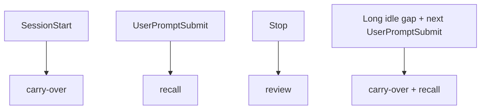
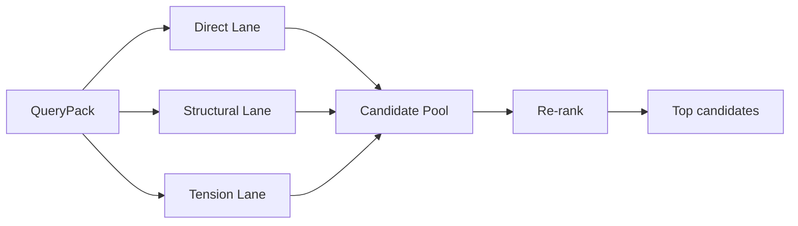
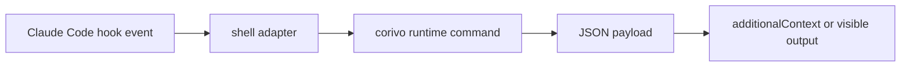

# Corivo Push / Recall Redesign

**Goal:** Replace the current single `suggest` mechanism with three explicit runtime mechanisms that are visible, low-threshold, and technically feasible inside Claude Code's plugin lifecycle: `carry-over`, `recall`, and `review`.

## Product Positioning

Corivo should no longer behave like a quiet "maybe relevant suggestion" system. It should behave like a memory companion that shows up whenever there is a real anchor in the current conversation.

The redesign keeps two constraints:

- No fake "presence score" or synthetic visibility KPI in the runtime.
- No random heterogenous reminders when the current conversation has no anchor.

The system is allowed to surface weak matches, but it must explicitly admit uncertainty.

## Runtime Model

Corivo runtime is split into three independent flows:

1. `carry-over`
   Surfaces unfinished or recently shifted memory at session start or session resume.
2. `recall`
   Surfaces memory before Claude answers, using the current user prompt as the primary anchor.
3. `review`
   Runs after Claude answers to record the turn, detect tension with existing memory, and optionally emit a short follow-up.

These flows are implemented as CLI/runtime commands, not as prompt-only behavior.

## Trigger Model



### Trigger Semantics

- `SessionStart`
  Returns at most one visible carry-over item tied to unfinished work, recent decision shifts, or a still-open discussion thread.
- `UserPromptSubmit`
  Returns at most one recall payload for the current prompt. This is the primary trigger for historical context injection.
- `Stop`
  Returns at most one short review payload. It does not own primary recall.
- `Long idle gap + next UserPromptSubmit`
  Treated as session resume. The runtime may prepend one carry-over item before normal recall runs.

## Retrieval Model

Recall is anchor-driven rather than vitality-driven.

### Query Pack

Every runtime command builds a `QueryPack` from available hook input:

- current prompt text
- last assistant message when available
- recent turn snippets when available
- current working directory / project identity if available
- extracted entities
- inferred intent
- recent surfaced memory ids for repetition control

### Retrieval Lanes



#### Direct Lane

- keyword overlap
- entity overlap
- same project / same asset / same person
- direct search via `searchBlocks`

#### Structural Lane

- same annotation prefix
- same domain
- association neighbors
- recently accessed related blocks

#### Tension Lane

Only anchored tension is allowed:

- current topic conflicts with an existing decision
- current topic touches a superseded block
- current topic depends on an unfinished or unresolved memory

There is no unanchored "let me remind you of something unrelated" behavior.

## Scoring Model

Each candidate is scored on:

- `anchorMatch`
- `importance`
- `tension`
- `actionability`
- `freshness`
- `repetitionPenalty`

There is no standalone "presence" score.

## Output Model

Runtime commands return structured payloads first, then adapters render them.

```ts
type CorivoSurfaceMode = 'carry_over' | 'recall' | 'challenge' | 'uncertain' | 'review';

interface CorivoSurfaceItem {
  mode: CorivoSurfaceMode;
  confidence: 'high' | 'medium' | 'low';
  whyNow: string;
  claim: string;
  evidence: string[];
  memoryIds: string[];
  suggestedAction?: string;
}
```

### Rendering Rules

- `carry-over`
  Visible, concise, session-opening reminder.
- `recall`
  Visible or injected before answer generation.
- `challenge`
  Visible and interruptive. Used when tension is high.
- `uncertain`
  Visible but self-qualified.
- `review`
  Short post-answer follow-up or correction.

### Example Outputs

```text
[corivo] 上次你停在“日志归档策略”，还没定。
原因：这是你昨天最后一轮讨论的未完成事项。
```

```text
[corivo] 你们之前已经决定主库继续用 PostgreSQL。
原因：当前问题和数据库实现有关。
依据：上周关于 database 的决策记录。
```

```text
[corivo] 我不确定这条是否完全相关，但它让我想到你们之前关于权限模型的讨论。
```

## Claude Code Adapter Contract

The Claude Code plugin remains hook-driven.



### Planned Hook Responsibilities

- `SessionStart` -> run `carry-over`
- `UserPromptSubmit` -> run `recall`
- `Stop` -> run `review`

The adapter should avoid embedding runtime logic in shell scripts. Shell scripts only:

- parse hook JSON
- call the right CLI command
- forward returned JSON/text to Claude Code

## Technical Feasibility Constraints

This design assumes only capabilities already aligned with the current plugin model:

- hook execution on lifecycle events
- shell command execution
- local CLI invocation
- returning `additionalContext`

It does not assume out-of-session push notifications. "Active reminders" only happen during a session or when the user returns to one.

## Migration Strategy

1. Keep `suggest` working as a compatibility shim during the transition.
2. Introduce new runtime commands and shared scoring utilities.
3. Update hook scripts to call the new commands.
4. Add tests for retrieval, scoring, and shell adapter behavior.
5. Deprecate the old `SuggestionEngine` path once the new flow is stable.
