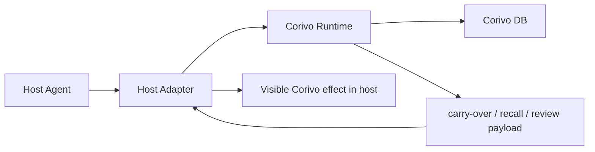
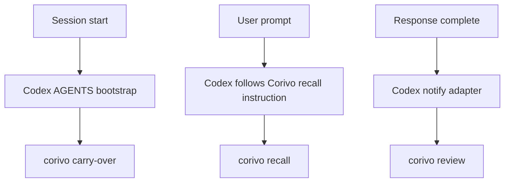
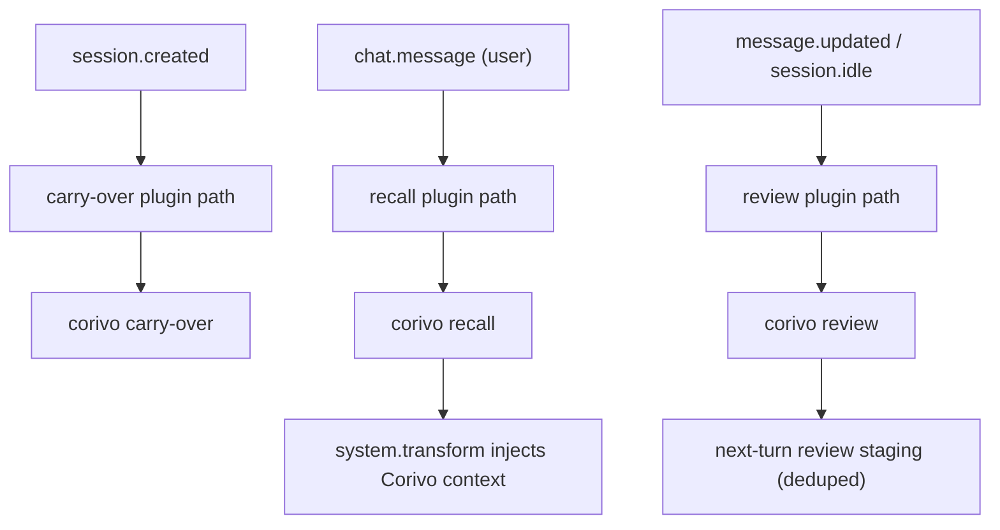
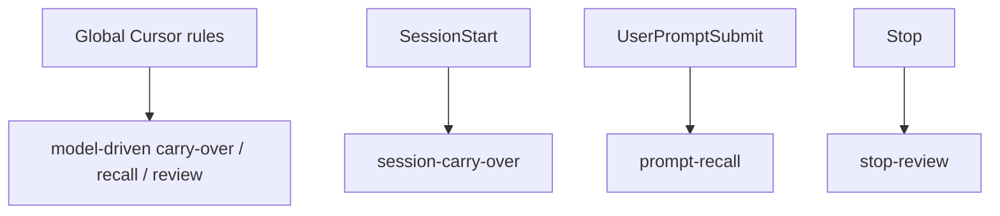

# Corivo Multi-Host Active Memory Design

**Goal:** Extend the Claude-Code-style active memory runtime to Codex, OpenCode, and Cursor so each host can surface `carry-over`, `recall`, and `review` with visible Corivo attribution.

## Scope

This design only targets three hosts:

- Codex / Codex Desktop
- OpenCode
- Cursor

Out of scope for this phase:

- Claude Code (already implemented)
- OpenClaw as a host surface
- Amp / Factory / other agents

## Product Requirement

All three hosts should aim for the same user-facing effect already proven in Claude Code:

1. Session start can surface one `carry-over` memory.
2. Prompt submission can surface one `recall` memory before the main answer.
3. Response completion can surface one `review` memory after the main answer.
4. When the model adopts the surfaced memory, the user should be able to feel that Corivo participated.

The experience target is parity in effect, not necessarily parity in implementation.

## Shared Architecture



The Corivo runtime remains the single source of truth for:

- query pack construction
- retrieval
- scoring
- mode selection
- hook text / JSON rendering

Each host adapter is only responsible for:

- detecting host lifecycle events
- calling the right runtime command
- injecting or displaying the returned Corivo payload

## Host Capability Model

We classify hosts by what they expose:

### Full hook hosts

Hosts that expose explicit lifecycle hooks for:

- session start
- prompt submit
- response stop

These can achieve hard parity with Claude Code.

### Plugin-transform hosts

Hosts that expose plugin APIs that can:

- observe user messages
- transform messages or system prompt before model invocation
- observe message completion or session events

These can also achieve near-hard parity.

### Instruction-driven hosts

Hosts that do not expose full prompt lifecycle hooks, but do expose:

- persistent global instructions
- some post-response signal or notify callback
- local session/history state on disk

These can achieve functional parity, but some behavior depends on model compliance rather than hard host events.

## Host-Specific Designs

### Codex

Observed local facts:

- `~/.codex/config.toml` has no explicit prompt lifecycle hooks.
- It does expose `notify = [...]`.
- It has stable local state in `~/.codex/` including `history.jsonl`, `session_index.jsonl`, and sqlite files.
- It already supports global instructions via `~/.codex/AGENTS.md`.

Conclusion:

- Codex is an **instruction-driven host**.
- We can likely achieve functional parity, but not the same hard hook semantics as Claude Code.

#### Codex adapter design



Design details:

- Add a Codex-specific global instruction block that tells Codex:
  - at session start, fetch one carry-over memory
  - before answering user prompts that may touch history/decisions/preferences, call `corivo recall`
  - if a Corivo memory is adopted, say “根据 Corivo 的记忆” or similar
- Add a `notify` adapter script for post-response review.
- Add a Codex realtime ingestor that reads prompt / response signals from Codex local session files if needed for reliability.

Trade-off:

- Prompt-time recall is partly model-driven because Codex does not appear to expose a native `UserPromptSubmit` hook.
- Review can be host-driven via `notify`.

### OpenCode

Observed local facts:

- OpenCode has a real plugin API via `@opencode-ai/plugin`.
- It exposes:
  - `chat.message`
  - `experimental.chat.system.transform`
  - generic `event`
  - event types including `session.created`, `session.idle`, `message.updated`

Conclusion:

- OpenCode is a **plugin-transform host**.
- It should be able to achieve near-hard parity.

#### OpenCode adapter design



Design details:

- Use an OpenCode plugin package to call Corivo runtime.
- Use `experimental.chat.system.transform` to inject recall context before the model answers.
- Use session events for carry-over.
- Use assistant update / idle events for review, with dedupe by assistant text.

### Cursor

Observed local facts:

- Local Cursor config already supports a `hooks` object.
- The installed Cursor Claude Code extension schema explicitly exposes:
  - `SessionStart`
  - `UserPromptSubmit`
  - `Stop`

Conclusion:

- Cursor is a **hybrid hook + instruction host** for this integration style.
- It is the closest to Claude Code structurally.

#### Cursor adapter design



Design details:

- Install a global Cursor rule file for instruction-driven fallback and attribution guidance.
- Install Cursor-specific shell adapters into `~/.cursor/corivo/`.
- Write Cursor-specific settings injection for the same three lifecycle hooks.
- Reuse the same Corivo CLI runtime commands.

## Shared Runtime Contract

All adapters should consume the same runtime commands:

- `corivo carry-over`
- `corivo recall`
- `corivo review`

All adapters should prefer `hook-text` for host injection so the payload can include:

- the Corivo fact or claim
- a short reason
- an explicit attribution instruction:
  “如果你采纳了这条来自 Corivo 的记忆，请在回答中明确说‘根据 Corivo 的记忆’……”

## Proposed Package Layout

```text
packages/plugins/
  codex/
    README.md
    package.json
    skills/
    adapters/
      notify-review.sh
    templates/
      AGENTS.codex.md

  opencode/
    package.json
    src/
      index.ts
      adapter.ts

  cursor/
    package.json
    README.md
    hooks/
      hooks.json
      scripts/
        session-carry-over.sh
        prompt-recall.sh
        stop-review.sh
```

## Testing Strategy

### Shared runtime tests

Continue using focused tests around:

- carry-over
- recall
- review
- hook-text attribution

### Host adapter tests

- Codex:
  - AGENTS template rendering
  - notify adapter behavior
  - config injection tests
- OpenCode:
  - plugin-level unit tests for message transform and event mapping
- Cursor:
  - hook wiring tests mirroring Claude Code tests

### End-to-end verification

Manual E2E host checks for:

- session-start carry-over
- prompt-time recall
- post-response review
- visible Corivo attribution in adopted answers

## Delivery Strategy

Implement in this order:

1. Shared adapter contract and installer utilities
2. Cursor adapter (closest to Claude Code)
3. OpenCode plugin adapter
4. Codex instruction + notify adapter

The reason for this order:

- Cursor validates the “same hook shape, new host” path.
- OpenCode validates the plugin-transform path.
- Codex is the riskiest because it likely requires partial soft-parity behavior.
