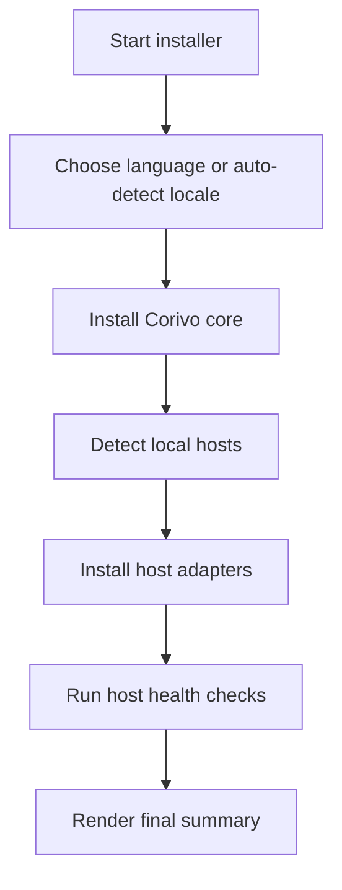
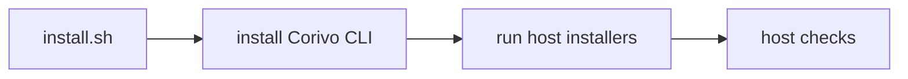
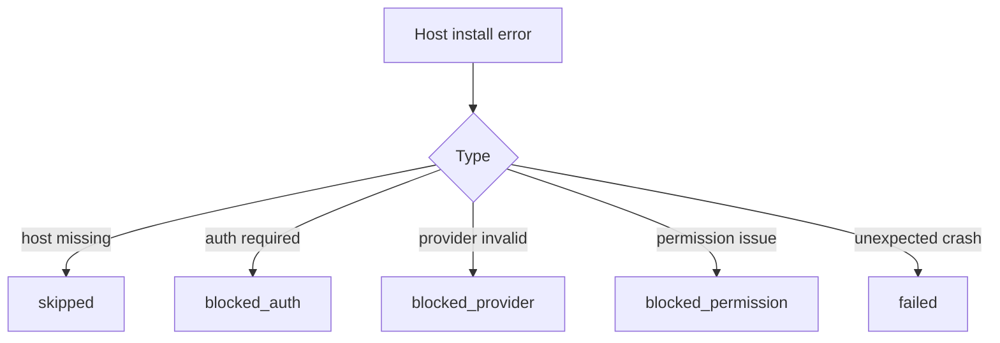

# Corivo One-Command Host Installer Design

## Goal

Upgrade `scripts/install.sh` from a core-only installer into a host-aware installer that:

- installs Corivo core
- detects supported local coding agents
- installs host adapters automatically
- validates each host after installation
- reports a clear, localized summary to the user

The supported hosts in scope are:

- Claude Code
- Codex
- Cursor
- OpenCode

## User Experience

The installer should feel like a guided setup, not a raw shell script dump.

### Flow



### UX principles

1. Show progress in human terms.
2. Never fail the whole install because one host is missing or blocked.
3. Report host status as `ready`, `blocked`, or `skipped`.
4. Tell the user exactly what to do next for blocked hosts.
5. Keep the script idempotent.

### Language selection

Priority:

1. Explicit `--lang zh|en`
2. Locale inference from `LANG` / `LC_ALL`
3. Interactive prompt when running in a TTY
4. Fallback to Chinese when no signal exists

The language layer should only affect user-facing copy, not paths, commands, or raw error text.

## Host Detection

Each host should be probed independently and return:

```ts
type HostProbe = {
  host: 'claude-code' | 'codex' | 'cursor' | 'opencode';
  found: boolean;
  reason?: string;
};
```

### Detection rules

- Claude Code: any of `~/.claude`, `~/.config/claude`, `~/Library/Application Support/claude`
- Codex: `command -v codex` or `~/.codex`
- Cursor: `command -v cursor` or `~/.cursor`
- OpenCode: `command -v opencode` or `~/.config/opencode`

## Installation Strategy

The shell installer should orchestrate, not duplicate host config logic.

### Preferred control flow



### Host installers

- Claude Code: shell-managed for now
- Codex: `corivo inject --global --codex`
- Cursor: `corivo inject --global --cursor`
- OpenCode: `corivo inject --global --opencode`

Long term, Claude Code should also move behind a CLI installer for consistency.

## Host Health Checks

The installer must distinguish between "installed" and "usable".

### Claude Code

- hooks scripts present
- `settings.json` contains Corivo hook entries

### Codex

- `~/.codex/AGENTS.md` contains Corivo block
- `~/.codex/config.toml` contains notify dispatch
- `~/.codex/config.toml` contains `sandbox_workspace_write.writable_roots`
- `codex --help` is runnable

### Cursor

- `~/.cursor/rules/corivo.mdc` exists
- `~/.cursor/settings.json` contains `SessionStart`, `UserPromptSubmit`, `Stop`
- `~/.cursor/cli-config.json` allows `Shell(corivo)`
- `cursor agent status` is runnable

### OpenCode

- `~/.config/opencode/plugins/corivo.ts` exists
- `opencode models` is runnable
- optional smoke check against the configured default model

## Result Model

Each host install should return:

```ts
type HostInstallResult = {
  host: string;
  status: 'ready' | 'blocked' | 'skipped' | 'failed';
  reason?: string;
  nextStep?: string;
};
```

Examples:

- `ready`: host adapter installed and basic health checks passed
- `blocked`: host found and adapter installed, but login/provider state prevents immediate use
- `skipped`: host not found
- `failed`: installer or verification crashed unexpectedly

## Summary Output

The final summary should be localized and explicit.

Example:

```text
[corivo] Installation complete

Core
- Corivo CLI: ready
- Memory DB: ready
- Background service: ready

Hosts
- Claude Code: ready
- Codex: ready
- Cursor: installed, but login is required
- OpenCode: installed, but provider verification failed

Next
- Run `cursor agent login`
- Fix OpenCode provider config, then rerun installer or `corivo doctor --hosts`
```

## Failure Handling



No single host failure should abort the full install unless Corivo core itself fails.

## Implementation Plan

1. Add localized message helpers to `install.sh`
2. Add host detection layer to `install.sh`
3. Backfill `corivo inject --global --codex|--cursor|--opencode` into the current branch CLI
4. Replace legacy Codex installer path in `install.sh` with CLI-driven installation
5. Add post-install health checks and final summary rendering
6. Add automated tests for language resolution, host detection, and host installer outputs

